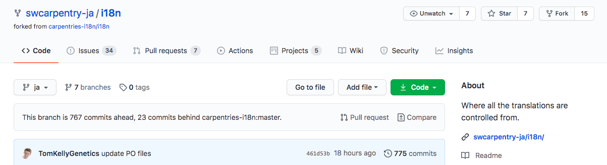
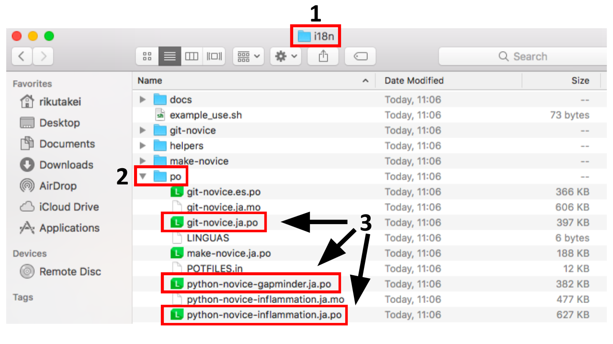
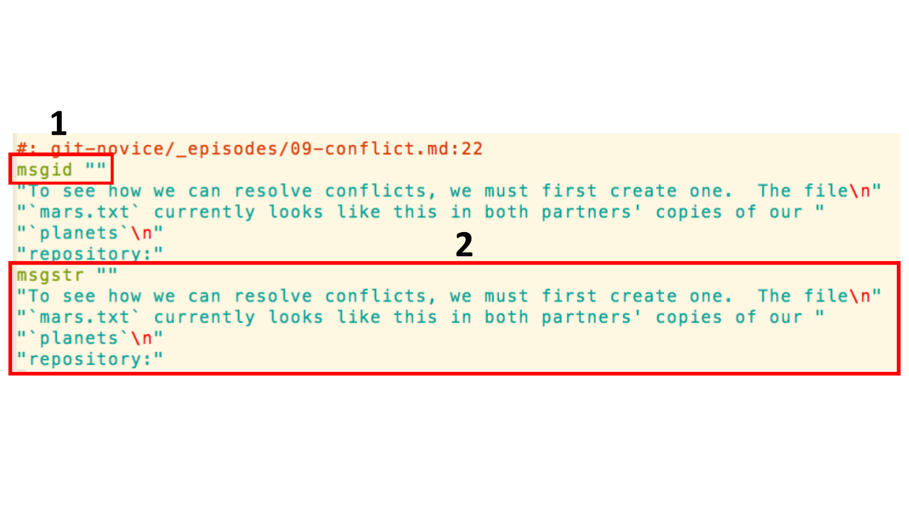

## Fork the repo

1. Click on the “Fork” button

## Clone/Download your fork

1. Make sure you are in your account and in the forked i18n repo
1. Click on “Clone”
1. Click on “HTTPS”
1. Click on the clipboard icon (this will copy the URL)
1. Go to terminal (or command line) and enter “git clone <URL>”
1. Check that there is an “i18n” folder

## Decide which lesson to translate

1. Go to SWC-ja’s i18n repo
1. Click on “Issues”
1. Click on any issue with “Translation” in the title
1. Read the description
1. Comment on the issue to let people know that you are working on this (e.g. “I am working on this!!”)

## Translate

1. Go to “i18n” folder
1. Go to “po” folder
1. Find any file with “.ja.po” file extension
1. Translate with your favorite PO editor or directly edit the file

## Directly editing the file

1. Do NOT change “msgid”
1. Translate anything in between the quotation marks in the “msgstr” block only

